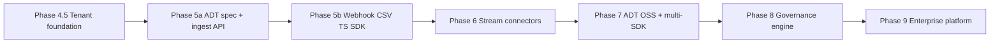

# Avarent Platform Evolution Roadmap

**Product:** Meridian  
**Mission:** Every lending decision should be observable, auditable, explainable, and defensible.

**Positioning:** Avarent is not a compliance dashboard. Avarent is the **system of record for AI-assisted lending decisions**.

**Core principle:** Avarent never requires replacement of existing decision systems. It acts as the governance layer on top of them.

**CEO review posture (2026-06):** Approach B — tenant-complete core before opening self-serve. See [Phase 4.5](#phase-45--tenant-foundation-prerequisite).

**Related:** Implementation tasks and eng-review decisions live in `ITERATION_PLAN.md`.

---

## Current state (pre-Phase 5)

| Area | Status |
|------|--------|
| Auth + onboarding | WorkOS AuthKit + Supabase identity, onboarding API |
| Tenant isolation | RLS + `company_members` (migrations applied) |
| Workflow UI | AppShell with 9 workflows |
| Investigations + ledger | Partial Supabase via AVA-17 (`threat_log`, `ledger_events`) |
| Monitoring, analyses, audit packets | localStorage + mock data |
| Public ingestion API | None |
| Event streaming | None |
| ADT specification | Not published |

**Blocker:** Split-brain persistence (browser localStorage vs Supabase). Phase 4.5 must complete before Phase 5.

---

## Dependency graph



**Rule:** Ingest before govern. Do not expand Phase 8 UI until Phase 5 events are real.

---

## Phase 4.5 — Tenant foundation (prerequisite)

**Goal:** Self-serve-ready multi-tenant product. Same data for every user in an org, on every device.

**Not in the original phase list — required before Phase 5.**

### Capabilities

- Migrate all `WORKFLOW_TENANT_REQUIREMENTS` services off localStorage to user-scoped Supabase repos
- Single write path: API → Supabase → client cache refresh (no dual-write)
- Identity test matrix (18 paths) + mandatory onboarding Playwright regression
- Server-side auth checks on every `/api/*` route
- Team invites via `company_members`
- Empty-org onboarding (optional sample data toggle; no forced mock seed for production)
- Inngest-dependent UI: deploy backends **or** feature-flag with clear "not configured" states
- Observability baseline: health check + error tracking (e.g. Sentry)
- PII policy enforced at schema: opaque `applicant_ref` only in Postgres (no raw applicant names)

### MVP cut line

| Ship now | Defer |
|----------|-------|
| Full Supabase cutover for investigations, ledger, monitoring, audit packets | Billing, data import pipeline |
| CI: `npm test` + `npm run build` on PR | Java/Go/Python SDKs |
| Staging deploy on Vercel | WorkOS Organizations (use `company_members` invites first) |

### Success criteria

- Two users in the same org see identical investigations and ledger entries
- Onboarding → Command Center works without manual env fixes
- No workflow reads localStorage as source of truth

### Maps to eng review

T1–T8 in `ITERATION_PLAN.md` (identity, AVA-17 bundle, tests). Extend with full `SERVICE_TENANT_REQUIREMENTS` migration.

---

## Phase 5 — Universal Decision Ingestion

**Goal:** Ingest decisions from any underwriting or AI-driven system regardless of vendor, model type, or deployment architecture.

### Capabilities

- Decision Ingestion API (`POST /api/v1/decisions`)
- Webhook ingestion (signed payloads, idempotency keys)
- Batch CSV ingestion (server-side validation, tenant-scoped)
- SDKs (in order): TypeScript → Python → Java → Go
- Model metadata capture
- Decision metadata capture
- Feature capture (SHAP / reason features)
- Adverse action capture (linked to `decision_id`)

### Supported sources (target)

- Internal underwriting models
- FICO decision engines
- Loan Origination Systems
- Agentic AI workflows
- LLM-based decision systems
- Rules engines
- Third-party underwriting APIs

### Architecture

```
Customer Decision System
        │
        ▼
  Ingest API / Webhook / CSV
        │
        ▼
  Normalize → ADT event
        │
        ▼
  Append decision_events (immutable)
        │
        ├──► ledger_events
        ├──► applicants (aggregate metrics)
        └──► adverse_actions (when denied)
```

### MVP cut line (Phase 5a + 5b)

| Ship in 5a | Ship in 5b | Defer |
|------------|------------|-------|
| ADT JSON Schema + OpenAPI | Webhook endpoint + HMAC verification | Java, Go SDKs |
| `POST /api/v1/decisions` | CSV batch import API | FICO-specific connector |
| `decision_events` table + RLS | `@avarent/adt` TypeScript package | Agentic workflow SDK samples |
| Idempotency via `decision_id` | Reference integration (mock LOS webhook) | Python SDK (until 2 design partners on TS) |

### Success criteria

- Any customer can connect an underwriting workflow in less than 1 hour (webhook + CSV + TS SDK)
- Avarent can reconstruct every captured decision end-to-end from `decision_events`

### Replaces / refactors

- `decisionGateway.ts` — today a browser simulator; becomes server-side ingest validation only
- `dataImportService.ts` — client CSV parser moves to server import API

### PII at ingest

- Accept opaque `applicant_identifier` (hashed/opaque ref)
- Reject or strip raw names, SSN, full addresses at API boundary
- Align `applicants` table with AVA-17 `applicant_ref` policy (migration required)

---

## Phase 6 — Event Streaming & Observability

**Goal:** Capture decisions in real time without modifying customer workflows.

### Capabilities

- Webhook ingestion (shared normalization layer with Phase 5)
- Kafka connectors
- AWS EventBridge connector
- Azure Event Hub connector
- Google Pub/Sub connector
- Real-time alerting
- Event replay
- Immutable event logs

### Architecture

```
Decision System
      → Event Stream (Kafka / EventBridge / Pub/Sub / webhook)
      → Avarent ingest normalizer
      → Compliance Engine (Inngest workers)
```

### MVP cut line

| Ship now | Defer |
|----------|-------|
| Webhook (from Phase 5) | Kafka connector |
| Append-only `decision_events` with replay by `decision_id` | EventBridge / Pub/Sub / Event Hub |
| Inngest worker: ingest → drift check → alert | Sub-second SLA guarantee |

### Success criteria

- Decision events appear in Avarent within seconds (webhook path)
- Full event lineage available for audit (offset + timestamp + source system)

### Builds on

- Phase 5 `decision_events` schema
- Inngest routes in `src/app/api/inngest/route.ts` (today throw without backends; wire to real workers)

---

## Phase 7 — Decision Telemetry Standard

**Goal:** Become the OpenTelemetry layer for AI lending decisions.

### Deliverable: Avarent Decision Telemetry (ADT)

**Standard fields:**

| Field | Type | Notes |
|-------|------|-------|
| `decision_id` | string (UUID) | Idempotency key; required |
| `model_name` | string | e.g. `fico_score9`, `internal_credit_v3` |
| `model_version` | string | Semver or vendor build id |
| `applicant_identifier` | string | Opaque aggregate ref only — no raw PII |
| `decision` | enum | `approved` \| `denied` \| `referred` \| `pending` |
| `confidence_score` | number | 0–1 or vendor-specific with `confidence_scale` |
| `timestamp` | ISO 8601 | Decision time (not ingest time) |
| `features_used` | array | `{ name, value, contribution? }` |
| `reason_codes` | array | Reg B–aligned codes where applicable |
| `adverse_action_data` | object | Notice payload when `decision` is denied |
| `source_system` | string | LOS name, vendor id, or `internal` |
| `organization_id` | string | Tenant scope (server-injected; not client-supplied) |

### Provide

- JSON Schema + OpenAPI spec (repo: `spec/adt/`)
- Documentation site section
- Open-source `@avarent/adt` instrumentation package
- Contract tests: valid ADT payloads round-trip through ingest

### MVP cut line

| Ship now | Defer |
|----------|-------|
| ADT v0.1 schema + validation | ADT v1.0 certification program |
| TypeScript types + validator | Codegen for Java/Go from schema |
| Spec published in repo | Third-party "ADT compatible" badge |

### Success criteria

- Third-party systems can emit ADT-compliant events without custom field mapping
- Avarent becomes vendor-agnostic infrastructure

**Sequencing note:** ADT v0.1 must land **before** multi-language SDKs (Phase 5 defer list). Spec first, one SDK, then generate.

---

## Phase 8 — Automated Governance Engine

**Goal:** Transform raw decisions into regulatory evidence.

### Capabilities

- Fair lending monitoring
- ECOA monitoring
- Reg B monitoring
- Adverse impact detection
- Model drift detection
- Investigation generation
- Evidence packet generation
- Regulator-ready audit exports

### Outputs

- Investigation narratives
- Audit trails
- Compliance reports
- Executive summaries

### Event-driven pipeline

```
ADT event ingested
      → fairness drift check (PSI, DPD)
      → threshold breach?
            yes → threat_log entry → investigation workflow
      → ledger_events append
      → audit_packet job (on demand or scheduled)
```

### MVP cut line

| Ship now | Defer |
|----------|-------|
| Drift rules on ingested cohorts | Full ECOA/Reg B rule library |
| Auto-create investigation on critical drift | LLM-generated narratives |
| Audit packet from real ledger + threats | Certified regulator export formats |

### Success criteria

- Every ingested decision is explainable and traceable via `decision_id`
- Compliance teams can generate evidence on demand

### Maps to existing UI

- Command Center, Investigations, Monitoring, Documentation, Audit History workflows
- Services to rewire: `fairnessDriftService`, `threatService`, `auditPacketService`, `adverseActionService`

---

## Phase 9 — Enterprise Governance Platform

**Goal:** Compliance control plane for AI-enabled lending.

### Capabilities

- Multi-model governance
- Model inventory management
- Approval workflows
- Governance scorecards
- Enterprise policy engine
- Cross-system decision lineage
- Continuous monitoring

### Target customers

- Banks
- Credit unions
- Fintech lenders
- Embedded finance providers

### MVP cut line

| Ship now | Defer |
|----------|-------|
| Model inventory (name, version, owner, status) | Enterprise policy DSL |
| Governance scorecard on Command Center | Cross-tenant benchmarking |
| Decision lineage graph (single org) | SOX/SOC2 control mapping automation |

### Success criteria

- Compliance officers can answer "which models touched this applicant's decision?" across systems
- Model changes require approval before production scoring

---

## Phase summary

| Phase | Theme | Depends on | Est. effort (human / CC) |
|-------|-------|------------|--------------------------|
| 4.5 | Tenant foundation | — | ~3–4 weeks / ~2–3 days |
| 5 | Universal ingestion | 4.5 | ~4–6 weeks / ~1 week |
| 6 | Event streaming | 5 | ~6–8 weeks / ~1–2 weeks |
| 7 | ADT standard | 5a (parallel with 5b) | ~2–3 weeks / ~3–5 days |
| 8 | Governance engine | 5, 6, 7 | ~8–12 weeks / ~2–3 weeks |
| 9 | Enterprise platform | 8 | ~12–18 weeks / ~3–4 weeks |

Estimates assume Phase 4.5 complete. CC estimates use eng-review compression ratios.

---

## Strategic risks

1. **SDKs before ADT** — four SDKs on a moving schema wastes effort. Spec first.
2. **Duplicate ingest paths** — Phase 5 webhooks and Phase 6 connectors must normalize to one ADT shape.
3. **PII at ingest** — init schema has `applicant_name` on `applicants`; AVA-17 uses `applicant_ref`. Resolve in Phase 4.5 migration.
4. **Governance UI before ingest** — current app looks like Phase 8; data plane is Phase 4.5. Do not add Phase 8 features until Phase 5 events are real.
5. **"<1 hour connect"** — requires a reference integration (sample LOS webhook + CSV template + TS quickstart). Build alongside Phase 5b.

---

## What exists today (code map)

| Roadmap concept | Current code |
|-----------------|--------------|
| Decision simulation | `src/services/decisionGateway.ts` |
| CSV import (client) | `src/services/dataImportService.ts` |
| Adverse action | `src/services/adverseActionService.ts`, `narrativeTranslator.ts` |
| Fairness drift | `src/services/fairnessDriftService.ts` |
| Investigations | `src/domains/investigations/`, `threatService.ts` |
| Ledger | `src/services/ledgerService.ts`, `supabaseWorkflowRepository.ts` |
| Audit packets | `src/services/auditPacketService.ts` |
| Async jobs | `src/app/api/inngest/route.ts` |
| Tenant contracts | `src/domains/identity/tenant-requirements.ts` |
| Identity | `src/lib/identity/resolve-context.ts` |

---

## Next actions

1. Complete Phase 4.5 (see `ITERATION_PLAN.md` eng-review tasks + full localStorage cutover)
2. Draft ADT v0.1 schema in `spec/adt/decision-event.schema.json`
3. Design `decision_events` migration (append-only, RLS, `company_id` scoped)
4. Implement `POST /api/v1/decisions` as first Phase 5a deliverable
